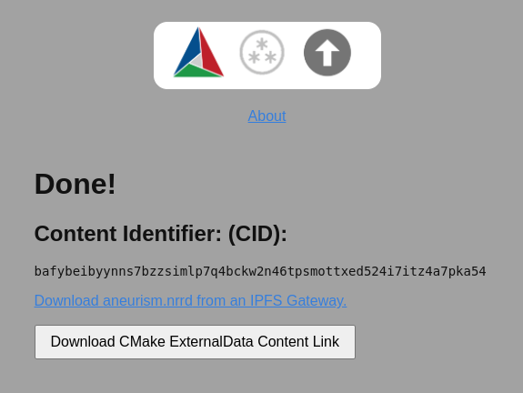

# cmake-w3-externaldata-upload

[](https://cmake-w3-externaldata-upload.on.fleek.co/)

[CMake Web3 ExternalData Upload UI](https://cmake-w3-externaldata-upload.on.fleek.co/)

## About

Since every local [Git](https://git-scm.com/) repository contains a copy
of the entire project history, it is important to avoid adding large
binary files directly to the repository. Large binary files added and
removed throughout a project\'s history will cause the repository to
become bloated, take up too much disk space, require excessive time and
bandwidth to download, etc.

A [solution to this
problem](https://blog.kitware.com/cmake-externaldata-using-large-files-with-distributed-version-control/)
which has been adopted by this project, is to store binary files such as
images in a separate location outside the Git repository. Then, download
the files at build time with [CMake](https://cmake.org/).

A \"content link\" file contains an identifying [Content Identifier
(CID)](https://proto.school/anatomy-of-a-cid). The content link is
stored in the [Git](https://git-scm.com/) repository at the path where
the file would exist, but with a \".cid\" extension appended to the file
name. CMake will find these content link files at *build* time, download
them from a list of HTTP server resources, and create symlinks or copies of
the original files at the corresponding location in the *build tree*.

The [Content Identifier (CID)](https://proto.school/anatomy-of-a-cid) is
self-describing hash following the [multiformats
](https://multiformats.io/) standard created by the Interplanetary
Filesystem ([IPFS](https://ipfs.io/)) community. A file with a CID for
its filename is content verifable. Locating files according to their CID
makes content-addressed, as opposed to location-addressed, data exchange
possible. This practice is the foundation of the decentralized web, also
known as the dWeb or Web3. By adopting Web3, we gain:

-   Permissionless data uploads
-   Robust, redundant storage
-   Local and peer-to-peer storage
-   Scalability
-   Sustainability

Contributors to upload their data through an easy-to-use,
permissionless, free service, [web3.storage](https://web3.storage/).

Data used in the Git repository is periodically tracked in a
dedicated [Datalad
repository](https://datalad.org)
and stored across redundant locations so it can be retrieved from any of
the following:

-   Local [IPFS](https://ipfs.io/) nodes
-   Peer [IPFS](https://ipfs.io/) nodes
-   [web3.storage](https://web3.storage/)
-   [estuary.tech](https://estuary.tech)\`
-   [pinata.cloud](https://pinata.cloud)
-   Kitware\'s HTTP Server

*Note: This currently requires an extended version of the ExternalData.cmake module developed in [itk-wasm](https://github.com/InsightSoftwareConsortium/itk-wasm). This has not been integrated into upstream CMake due to the availability of C++ CID verification code to complete the feature set in a
portable way.* 

## Development

- Clone the repository:

```sh
git clone https://github.com/InsightSoftwareConsortium/cmake-w3-externaldata-upload
cd cmake-w3-externaldata-upload
```

- Change to this directory and install dependencies

```sh
cd cmake-w3-externaldata-upload
npm install --location=global pnpm
pnpm install
```

- Run the dev server

```sh
pnpm dev
```

- Test registration / file upload

**Note: building and serving are required to test login/registration**

```sh
pnpm build
pnpm preview
```
